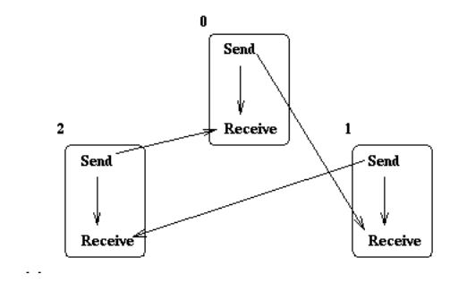

# 6: Синхронизация. Основы MPI

Установить на домашней системе MPI и прислать отчет в виде скринов, демонстрирующих выполнение программы осуществляющей пересылки текстовых сообщений между тремя потоками в соответствии со схемой, представленной на слайде 19 лекции по MPI.  
За основу можно взять пример 02.

Схема 19 слайда с лекции:  

- `./pics/`: скриншоты выполнения программы и изображение модели.
- `./main.cpp`: исходный код
- `./Makefile`: файл сборки

`$ make` для сборки.  
`$ make run` для запуска программы (программа будет запущена с флагом `--mca opal_warn_on_missing_libcuda 0`, чтобы избежать ошибки не нахождении библиотеки для `CUDA`, у меня видеокарта от AMD).

Представлено 2 скриншота:
- `./pics/3.png`: три процесса (как указано в условии задачи)
- `./pics/10.png`: десять процессов (для проверки корректности работы программы)